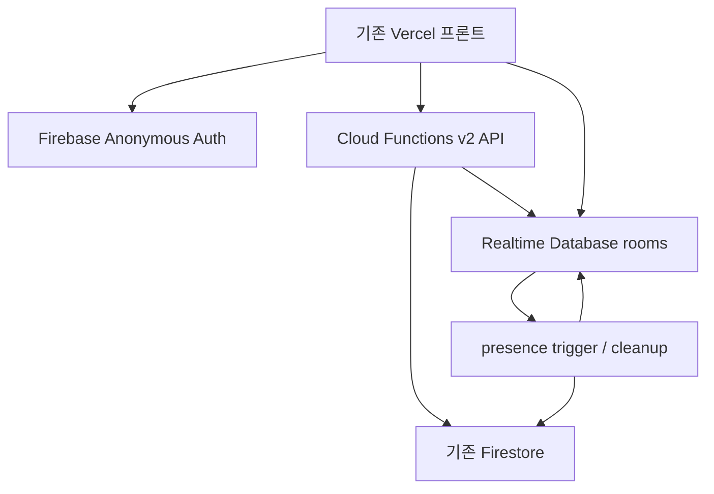

# Firebase 이전 계획 및 운영 전환 기록

분석 기준: `ab418d5` (2026-10-03). 운영 프론트: https://sequencepang.vercel.app

## 2026-10-06 현재 진행 상황

- PR #37에 최신 main `8a7566f`를 병합했다. PWA 캐시를 v30으로 올리고 최신 출시 안내/바로가기를 유지했다. 병합 충돌은 해결됐다.
- 사용자 PC에서 Firebase CLI 로그인 후, Windows 시스템 인증서를 사용해 기존 `sequencepang` 프로젝트에 배포했다. 서비스 계정 키나 새 프로젝트는 만들지 않았다.
- `api`, `roomPresence`, `cleanup` 모두 Node 22 / `asia-southeast1` / 최소 인스턴스 0으로 ACTIVE다. 처음 Eventarc 권한 전파가 늦어 실패했던 presence 함수는 재배포로 해결했다.
- RTDB/Firestore 규칙과 랭킹 인덱스 배포 완료. 랭킹 인덱스 4개가 READY이며, 매분 cleanup Scheduler가 ENABLED이고 실제 호출이 200이다. 빌드 컨테이너 보관 기간은 7일로 설정했다.
- `/health`는 200, 미인증 API 401, 허용하지 않은 origin 403, 미인증 RTDB 401, 브라우저 Firestore 읽기 403을 확인했다. 실제 어제/오늘의 기존 랭킹도 조회된다.
- 최신 main 기준 엔진 55/55, backend unit 5/5, Emulator 통합 11/11, desktop/mobile 브라우저 7개 흐름 통과. production build와 diff check 통과.
- 브랜치 Preview `dpl_82J1eJK2CWwBcLdh3TuqrWHPJgMj`가 READY이며 실제 Firebase 정상 게임/오늘·주간·내 순위/2인 점수 동기화/새로고침/재접속/방장 위임/명시적 퇴장/빈 방 삭제까지 7개 흐름 모두 통과했다. 실제 기존 어제 1등 기록도 조회된다. 모바일 390×844에 가로 넘침이 없으며 Render 요청과 uncaught error는 0건이다. [원격 결과](verification/preview-browser-results.json).
- 현재 정상 production 롤백 대상은 `dpl_BA6pawhy4JvrxPJ1DsybfhcnNqnZ` / main `8a7566f`다. Production 전환과 Render 삭제는 아직 실행하지 않았다.

아래의 2026-10-03 미배포/CLI 미인증 기록은 당시 상태다. 현재 배포 상태는 이 절과 최신 원격 검증 결과를 따른다.

Windows에서 `self-signed certificate in certificate chain` 오류가 나면 Node의 시스템 CA 지원을 사용한다. 인증서 검증을 비활성화하지 않는다.

```powershell
$env:NODE_OPTIONS = '--use-system-ca'
npm run deploy:firebase -- sequencepang
```

원격 브라우저 점검은 확인된 프로젝트와 운영/브랜치 Preview만 허용한다. 테스트 점수는 실제 타일 드래그와 정상 게임 종료로 제출하며, 운영 기록을 삭제하거나 수정하지 않는다. 매 실행의 닉네임은 고유하게 생성해 기존 닉네임 중복 제거 정책과 충돌하지 않는다. 결과는 `docs/verification/preview-browser-results.json` 또는 `production-browser-results.json`과 각 접두사가 붙은 화면에 저장된다.

```powershell
$env:SEQUENCEPANG_VERIFY_PROJECT = 'sequencepang'
$env:SEQUENCEPANG_VERIFY_URL = 'https://sequencepang-git-migration-firebase-serverless-cooolguy.vercel.app/'
node scripts/browser-check.cjs
```

보호된 Preview는 먼저 로그인하거나 유효기간이 짧은 Vercel 공유 링크를 사용한다. 공유 토큰/로그인 정보는 저장소에 기록하지 않는다.

## 현재 구조 분석 (구현 전 작성)

- `server/server.js`: Express JSON API, IP별 메모리 rate limit, 정적 파일/리다이렉트, 실시간 소켓 서버.
- `server/scoreRoutes.js`: 세션 발급, 점수 검증, `scores`/`suspicious_scores` 저장, KST 일간/주간/시즌/어제 조회, 오늘 내 순위. 필드 없는 옛 기록을 보충 조회하고 playerId → 닉네임 순서로 중복 제거한다.
- `server/firestore.js`: 서비스 계정 환경변수로 기존 Firestore 연결. 공개 프로젝트 ID/Web Config는 저장소에 없다. 기존 프로젝트를 확인하지 않고 운영 배포하면 안 된다.
- `server/gameSessionStore.js`: Map + random token + 시작 시각. 동일 인스턴스 내 예약/완료/해제만 지원하며 인스턴스 재시작/확장에 안전하지 않다.
- `server/socketHandlers.js`/`roomStore.js`: 메모리 방, 최대 30명, 대소문자 무시 닉네임 중복 검사, 방장 시작/위임, 점수와 이전 최고 점수. 실시간 점수는 0 이상 safe integer만 검사하고 감소도 허용한다. 재시작하면 방이 사라진다.
- `client/src/scoreClient.js`: HTTP 호출. `client/src/socketClient.js`: 원격 스크립트 로딩. `gameEngine.js`는 이벤트/메서드 인터페이스를 사용하므로 RTDB adapter로 게임 계산·화면을 유지할 수 있다.
- 기존 자동 테스트는 순수 게임 엔진에 집중되어 있고 API·규칙·멀티플레이 테스트는 없다.
- 기존 점수 상한은 운영 방침상 `Number.MAX_SAFE_INTEGER`, 최대 콤보는 10000, 세션 TTL 10분, 시간 허용 오차 15초, SCORE_VERSION 1.4.0이다. 이번 작업에서 점수 공식/상한/시즌/랭킹 데이터는 변경하지 않는다.

## 기능 대응표

| # | 기존 기능 | Firebase 대응 | 로컬 확인 |
|---|---|---|---|
| 1 | 게임 시작 세션 발급 | 인증된 HTTP Function → 단기 Firestore `game_sessions` | ✅ E/B |
| 2 | session token 검증 | 무작위 256-bit token의 SHA-256 hash 비교 + Auth UID 소유권 | ✅ U/E |
| 3 | 실제 플레이 시간 | 서버 시작 시각/TTL/기존 15초 오차 검증 | ✅ U/E/B |
| 4 | 동일 세션 재사용 방지 | 세션 소비와 점수 저장을 하나의 Firestore transaction으로 처리 | ✅ E |
| 5 | 점수/최대 콤보 | 기존 validation과 analytics whitelist 보존 | ✅ U/E |
| 6 | 비정상 기록 | 기존 `suspicious_scores`에 기존 필드/사유 저장 | ✅ E |
| 7 | 닉네임/욕설 | 기존 filter와 사전 재사용, 방 이름도 서버에서 검증 | ✅ U/E |
| 8 | 오늘 랭킹 | 기존 query/응답/KST 날짜 유지 | ✅ E/B |
| 9 | 주간 랭킹 | 기존 query/응답/월요일 KST 유지 | ✅ E/B |
| 10 | 어제의 1등 | 기존 조회/응답 유지 | ✅ E |
| 11 | 오늘 내 순위/TOP 30 cutoff | 기존 중복 제거와 순위 응답 유지 | ✅ E/B |
| 12 | 레거시 랭킹 | 기존 `scores`, version, playerId, supplement 조회 유지; 데이터 이동 없음 | ✅ U/E |
| 13 | 방 생성/입장 | 인증된 Function의 RTDB transaction | ✅ E/B |
| 14 | 최대 30명 | 서버 transaction 내 원자적 정원 검사 | ✅ E |
| 15 | 중복 닉네임 | transaction 내 정규화된 이름 검사 | ✅ E |
| 16 | 방장 | Auth UID와 서버 관리 hostUid | ✅ E/B |
| 17 | 시작 동기화 | 서버 roundId/startsAt + RTDB 구독/서버 시각 오프셋 | ✅ E/B |
| 18 | 실시간 순위 | RTDB 구독, 본인 점수만 갱신, 기존 UI 응답 형식 유지 | ✅ E/B |
| 19 | 접속 종료 | 연결마다 onDisconnect remove + 서버 presence trigger | ✅ E/B |
| 20 | 자동 방장 위임 | 온라인 참가자 중 joinedAt/UID 순으로 서버 transaction | ✅ E/B |
| 21 | 빈 방 자동 정리 | 명시적 퇴장 즉시 삭제, 끊긴 연결은 유예 후 scheduled cleanup | ✅ E/B |

U = backend unit, E = Emulator 통합, B = 실제 브라우저. 운영 검증은 모든 항목에서 아직 대기 중이다.

## 설계 결정

세션은 서명 token만 사용하는 방식 대신 **Firestore 문서 + transaction**을 선택한다. 서명만으로는 재사용 방지를 위해 별도 사용 기록이 필요하다. 문서 방식은 token hash, UID, 시작/만료 시각과 소비 상태를 함께 저장하고 `scores` 쓰기와 원자적으로 커밋할 수 있다. 실패한 transaction은 세션을 소비하지 않는다. 런타임이 만료를 검사하므로 TTL 삭제 지연은 보안에 영향을 주지 않는다.

Admin SDK는 기본 런타임 인증을 사용한다. 키 파일·private key·기존 서비스 계정 JSON은 복사하지 않는다. `.firebaserc`에는 Console에서 기존 데이터와 함께 확인한 프로젝트 ID `sequencepang`을 기록했다. 로컬 검증은 격리된 `demo-sequencepang` emulator 프로젝트만 사용하며 실제 Firebase 프로젝트를 생성하지 않는다.

RTDB 방/참가자/닉네임/방장/round는 Functions만 변경한다. 브라우저는 가입된 방을 읽고, 자신의 연결 presence와 현재 round의 점수/최고점/서버 timestamp만 쓸 수 있다. 점수는 정수/비음수/단조 증가/round 일치/갱신 간격을 검사한다. 실시간 숫자 자체가 게임 엔진의 정당한 결과임을 입증하는 replay 검증은 기존에도 없으므로 완전한 부정행위 방지라고 주장하지 않는다.

운영 전환은 Functions·규칙 배포 → Vercel preview 검증 → production 전환 → 관찰 → 유료 서비스 삭제 순서다. 그전까지 기존 운영 배포와 백엔드를 유지한다. 롤백은 새 코드의 fallback URL이 아니라 이전 Vercel deployment/기존 Git commit을 복원하는 방식이다.

## 구현된 구조



Functions의 `api`는 서버리스 Express handler이고 별도 HTTP 서버를 listen하지 않는다. `roomPresence`는 연결 leaf의 생성/삭제에 반응하고, `cleanup`은 매분 단기 상태만 정리한다. 모든 Function은 최소 인스턴스 0으로 실행한다. 초기 cold start는 있을 수 있다.

기존 Firestore의 default database/`scores`/`suspicious_scores`를 그대로 사용한다. 데이터 migration·초기화·기존 문서 재작성은 없다. 새 점수에는 기존 필드 외에 `authUid`만 추가한다. 점수 문서 ID는 세션 UUID이고, 세션 소비와 점수 쓰기가 함께 커밋된다. 새 컬렉션은 `game_sessions`, `request_limits`, `ranking_state`, `leaderboard_cache`이다. 정리 작업은 `scores`와 `suspicious_scores`에 접근하지 않는다.

일간/주간 캐시는 Firestore에 최대 30초 저장하고 점수 transaction에서 공통 revision을 증가시켜 인스턴스 간 무효화한다. 어제의 기록은 날짜별 읽기 캐시만 유지한다. 기존 랭킹의 query 300건·fallback/레거시 보충 1200건 정책을 보존했으므로, 이 범위 밖의 모든 기록까지 순위가 정확하다고 새로 보장하지는 않는다.

RTDB 구조:

```text
rooms/{roomId}
  hostUid, isStarted, mode, createdAt, expiresAt, cleanupAt, roundId, startsAt
  players/{authUid}
    nickname, nicknameKey, score, highestScore, joinedAt, connected
    disconnectedAt, scoreRoundId, lastScoreAt
    connections/{tabConnectionId}: true
```

닉네임·정원·입장·퇴장·방장·round 변경은 서버 transaction만 수행한다. 미사용 코드에 입장하면 방을 생성하는 기존 동작도 유지한다. 접속별 `onDisconnect().remove()`를 먼저 등록하고 presence를 쓴다. 온라인 방장이 없어지면 가장 먼저 입장한 온라인 참가자에게 위임한다. 연결이 끊긴 참가자는 45초 동안 보존하므로 짧은 재접속에서 같은 UID로 복구한다. 여러 탭 중 하나가 끊겨도 나머지 연결이 있으면 online이다. 명시적 퇴장은 해당 UID의 참가자를 제거한다.

방은 마지막 게임 시작부터 최대 2시간 유지한다. 비어 있는 방은 즉시 제거하고, 모두 연결을 잃은 방은 45초 유예 이후 정기 작업에서 제거한다. 정기 작업 간격과 재시도로 실제 삭제가 유예보다 늦어질 수 있다. 서버가 생성한 1.5초 후 `startsAt`과 `.info/serverTimeOffset`을 사용해 기존 카운트다운을 함께 시작한다. 진행 중 방에 신규 참가자는 입장할 수 없다. 대기실 새로고침은 sessionStorage의 코드와 지속된 Auth UID로 복구하며, 예전 start 신호를 다시 실행하지 않는다.

## 변경된 파일

| 파일 | 역할 |
|---|---|
| `firebase.json`, `.firebaserc`, `firebase.web-config.json` | Emulator/배포 구성, 확인된 기존 프로젝트 ID와 공개 Web Config |
| `database.rules.json` | 참가한 방 읽기와 본인 presence/점수만 허용 |
| `firestore.rules`, `firestore.indexes.json` | 브라우저 직접 접근 차단, 기존 랭킹용 인덱스 |
| `functions/package.json`, `functions/package-lock.json`, `functions/.env.example` | Node 22 runtime과 서버 의존성/공개 설정 |
| `functions/src/index.js`, `app.js`, `firestore.js` | HTTP/presence/scheduler exports, CORS/Auth, 기본 Admin 인증 |
| `functions/src/gameSessionStore.js`, `rateLimit.js` | 영속 세션·1회성 저장, UID/IP 분산 rate limit |
| `functions/src/scoreRoutes.js`, `constants.js`, `profanityFilter.js`, `data/profanityWords.json` | 기존 점수/랭킹/욕설 정책 재사용 |
| `functions/src/roomService.js`, `roomRoutes.js` | RTDB transaction 기반 방 제어와 정리 |
| `client/src/firebase.js`, `client/.env.example` | modular Firebase 초기화, Anonymous Auth, 인증된 HTTP 호출 |
| `client/src/scoreClient.js`, `socketClient.js` | Functions 호출과 RTDB event adapter |
| `client/src/gameEngine.js` | playerId 세션 binding, 생성 flag, 대기실 재접속 연결만 수정 |
| `client/public/service-worker.js`, `update-notes.md` | cache version 갱신과 인프라 전환 안내 |
| `package.json`, `package-lock.json`, `vite.config.js`, `vercel.json`, `.gitignore` | legacy runtime 의존성/proxy 제거, 테스트 및 SPA 설정 |
| `scripts/emulators.cjs`, `emulator-loopback.cjs`, `browser-check.cjs`, `configure-firebase.cjs`, `deploy-firebase.cjs` | 로컬 검증, 확인한 공개 환경변수 생성, 기존 프로젝트에만 배포 |
| `tests/firebase/unit.test.cjs`, `emulator.test.cjs` | 점수·세션·레거시·방·보안·presence 회귀 테스트 |
| `README.md`, `CLAUDE.md`, 이 문서, `docs/verification/` | 개발/배포/검증 증거 |
| 기존 `server/` 전체 | Express 점수 정책을 Functions로 옮긴 뒤 메모리 서버/소켓 구현 제거 |

게임 엔진·점수 공식·CSS/게임 화면은 변경하지 않았다. 저장소 코드 및 새 프론트 bundle에 유료 서비스의 원격 주소/소켓 로딩/이전 환경변수 의존성을 남기지 않는다. 기존 운영 배포는 전환 완료 전까지 그대로 둔다.

## Security Rules

실제 규칙은 [`database.rules.json`](../database.rules.json)과 [`firestore.rules`](../firestore.rules)에 있으며 Emulator로 실행했다. **2026-10-03에 RTDB 규칙을 기존 프로젝트의 실제 instance에 게시했다.** 기존 Firestore 규칙은 이미 전체 브라우저 접근을 `false`로 차단하고 있어 같은 권한 정책이다. 저장소의 Firestore 규칙 파일 및 Functions 배포는 CLI 인증 이후 진행한다.

| 대상 | 허용 | 거부/검증 |
|---|---|---|
| RTDB root 및 rooms 목록 | 없음 | 미인증/일괄 읽기·쓰기 거부 |
| 특정 방 읽기 | `players/{auth.uid}`가 이미 존재하는 참가자 | 코드만 아는 외부 사용자 읽기 거부 |
| 방 metadata·참가자 생성/삭제·닉네임·host/round | Functions Admin SDK | 클라이언트 전체 거부 |
| 본인 `connections/{connectionId}` | admitted UID의 true 저장/leaf 삭제 | 타인 presence/임의 값/참가자 생성 거부 |
| 본인 `score`, `highestScore`, `lastScoreAt`, `scoreRoundId` | 연결이 있고 현재 round가 시작됐으며 방이 만료되지 않은 UID | safe integer, 0 이상, 점수 감소 금지, 최고점은 기존 최고점/현재 점수 중 큰 값, 서버 timestamp, 최소 700ms 간격, 현재 round 일치 |
| Firestore 모든 브라우저 접근 | 없음 | `scores`, `suspicious_scores`, `game_sessions` 등을 직접 읽거나 쓰는 것 거부 |

최고점을 따로 부풀리거나 이전 round의 지연된 update를 새 round에 쓰는 것도 거부한다. Functions는 Admin SDK로만 Firestore를 쓴다. API에서 ID token을 확인하고 세션의 UID·닉네임·기존 playerId를 묶는다. 기존 playerId는 레거시 중복 제거 식별자이며 사용자 입력의 게임 결과 자체를 암호학적으로 증명하는 값은 아니다.

Auth UID와 RTDB 규칙이 타인의 점수/방 변조를 제한하지만 본인이 임의의 허용 범위 점수를 보내는 행위는 replay 검증 없이는 완전히 차단할 수 없다. 기존보다 정수/소유권/감소/갱신 간격/round 검사를 강화했다. App Check는 이번 필수 인증을 대체하지 않으며 추후 별도 도입할 수 있다.

API는 허용한 정확한 origin에만 CORS 응답을 준다. Firebase 인증 후 UID당 120회/분, IP당 600회/분(학교 등 공유 IP 고려), 세션/점수 쓰기 UID당 20회/분, 방 제어 UID당 30회/분으로 제한한다. Firebase Web Config는 공개 설정이고 권한은 Auth/Rules/서버 검증이 보장한다.

## 필요한 환경변수

Vercel **Preview에는 아래 필수 공개 설정 7개를 Config 유형으로 저장했다. Production은 아직 변경하지 않았다.** 값은 [`firebase.web-config.json`](../firebase.web-config.json)에 있으며 `npm run configure:firebase -- sequencepang`으로 로컬 환경변수 파일을 생성할 수 있다. 다른 설정이 있는 기존 파일은 덮어쓰지 않는다. Vite 값은 빌드 시 bundle에 포함되므로 변경 후 새로 build/deploy해야 한다.

| 변수 | 값의 출처/설명 |
|---|---|
| `VITE_FIREBASE_API_KEY` | 기존 프로젝트의 등록된 Web app config |
| `VITE_FIREBASE_AUTH_DOMAIN` | 동일 Web app config의 authDomain |
| `VITE_FIREBASE_PROJECT_ID` | 기존 `scores`가 있는 정확한 projectId |
| `VITE_FIREBASE_DATABASE_URL` | 실제 사용할 RTDB instance의 Console URL |
| `VITE_FIREBASE_APP_ID` | 동일 Web app config의 appId |
| `VITE_FIREBASE_FUNCTIONS_REGION` | 아래 `DEPLOY_REGION`과 동일 |
| `VITE_FIREBASE_FUNCTIONS_URL` | 선택. 배포된 `api`의 base URL. 비우면 region/projectId로 cloudfunctions.net URL을 계산 |
| `VITE_USE_FIREBASE_EMULATORS` | 운영/preview는 `false`; localhost 개발에서만 `true` |

Functions의 `functions/.env.<기존-project-id>`에는 다음 공개 설정을 넣는다. `.env` 파일은 커밋 대상이 아니다.

| 변수 | 설정 |
|---|---|
| `DEPLOY_REGION` | 실제 RTDB 위치와 event trigger 지원 리전에 맞춘 값. 예제의 asia-southeast1을 확인 없이 사용하지 않기 |
| `RTDB_INSTANCE` | RTDB URL hostname 첫 부분의 정확한 instance ID |
| `RTDB_DATABASE_URL` | 위 instance의 정확한 HTTPS URL; 프론트의 databaseURL과 동일 |
| `FRONTEND_ORIGINS` | prod/허용 preview의 origin을 쉼표로 구분. wildcard 사용 안 함 |

서비스 계정 private key/JSON은 필요 없다. Firebase/Google Cloud 런타임의 application-default credentials를 사용한다. Emulator 환경변수는 Suite가 자동 설정한다. 과거의 API/소켓 환경변수는 새 코드에서 참조하지 않으므로 전환 검증 후 Vercel 설정에서도 제거한다. 이전 deployment를 롤백용으로 보존한다.

## Firebase Console에서 직접 확인/설정할 작업

2026-10-03 사용자 로그인 후 아래 작업을 실제 Console에서 진행했다. Console 로그인은 이 실행 환경의 Firebase CLI 인증을 자동 제공하지 않는다. Console 내/독립 Cloud Shell과 기존 프로젝트의 Google Cloud Functions 관리 화면 모두 이 브라우저에서 `Site Unavailable / Unable to access this site`로 열려 배포 명령이나 GUI 배포를 실행할 수 없었다. CLI도 `Failed to authenticate, have you run firebase login?`를 반환했다. 남은 직접 작업은 아래 **CLI 배포**이며 새 결제 업그레이드나 서비스 계정 키는 요구하지 않는다.

| 항목 | 확인/적용 결과 |
|---|---|
| 기존 프로젝트 | `sequencepang`, project number `147997579779`; 기존 Web app 1개 |
| Firestore | `(default)`, `asia-northeast3`; `scores`와 `suspicious_scores` 및 기존 필드 확인. 데이터 쓰기/이동/초기화 없음 |
| Firestore Rules/Indexes | 전체 브라우저 read/write 거부. `scores`의 시즌/일간/주간 복합 인덱스 3개가 사용 설정됨. CLI 배포 시 기존 인덱스 삭제 없이 호환 여부 확인 |
| Billing | Blaze 이미 활성화; 결제 변경 없음 |
| RTDB | 같은 프로젝트에 `sequencepang-default-rtdb` 생성; 싱가포르 `asia-southeast1`; 잠금 모드로 시작 후 검증한 `database.rules.json` 게시 |
| Anonymous Auth | 실제 제공업체 사용 설정됨. 설정된 원격 Preview에서 익명 로그인 성공과 Console의 테스트 계정 생성을 확인. 계정 자동 삭제/Identity Platform 업그레이드 없음 |
| Web Config | 기존 앱 ID `1:147997579779:web:7050ee7d014693c3334c36`; 공개 설정 파일에 기록 |
| Vercel | 기존 `sequencepang` 프로젝트 Preview에 필수 변수 7개 저장. 원래 환경변수 목록에는 레거시 API/소켓 변수가 없었음. Production 변경 없음 |
| Functions/production 검증 | 아직 미실행; CLI 인증·실제 배포 필요 |

실제 RTDB URL: `https://sequencepang-default-rtdb.asia-southeast1.firebasedatabase.app`. Functions도 `asia-southeast1`로 설정하여 trigger의 instance/리전을 맞춘다. OAuth 승인 도메인은 localhost 및 기본 Firebase 도메인이며 Anonymous 인증에는 OAuth redirect가 필요하지 않다. 다른 인증 제공업체를 도입할 때 해당 Vercel 도메인을 별도로 승인한다.

다음 Console 체크는 배포 시점에 재확인할 항목이다. 프로젝트/Blaze/RTDB/Anonymous/Web Config 확인은 완료했다.

1. [Firebase Console](https://console.firebase.google.com/)에 기존 프로젝트 소유 계정으로 로그인하고, default Firestore의 `scores`/`suspicious_scores`가 있는 **기존 프로젝트**를 선택한다. project ID를 확인한다. 기존 서버와 새 Functions 모두 default Firestore를 사용한다.
2. 기존 Firestore의 현재 Rules/Indexes와 다른 앱 사용 여부를 확인한다. 이 저장소의 deny-all 규칙을 그대로 덮어쓰기 전에 필요한 다른 앱 규칙/인덱스를 병합한다. 기존 인덱스 삭제 질문에는 동의하지 않는다. 프로젝트에 다른 서버 Functions가 있다면 새 `sequencepang` codebase에 영향을 받지 않는지도 확인한다.
3. Functions 배포에 필요한 Blaze가 이미 활성화되어 있는지 확인한다. 없으면 소유자가 결제 연결/업그레이드를 직접 승인한다. [Firebase 배포 요구사항](https://firebase.google.com/docs/functions/get-started). 최소 인스턴스는 0이지만 Functions/Firestore/RTDB/Scheduler 사용량에 따라 비용이 발생한다. 기존 1200건 랭킹 보충 조회와 transaction도 과금 대상이다.
4. Authentication → Sign-in method → Anonymous를 활성화한다. 실제 Vercel domain과 사용하는 preview domain의 Authorized domains/API key restrictions를 확인한다.
5. 같은 프로젝트의 Realtime Database를 확인한다. 없다면 **그 프로젝트 안에** RTDB만 추가한다. locked mode로 만들고 위치/instance/URL을 기록한다. Test Mode/public write로 두지 않는다.
6. 프로젝트 설정 → 기존 Web app의 공개 config를 사용한다. Web app이 없으면 동일 프로젝트에 Web app만 등록한다. 새 Firebase 프로젝트/새 Firestore는 만들지 않는다.
7. 배포 계정이 기존 프로젝트의 Functions/Firestore Rules/RTDB Rules 배포 권한을 갖는지 확인한다. CLI에 로그인하며 private key를 다운로드하거나 저장소로 복사하지 않는다.

RTDB를 새로 추가해도 기존 Firestore 랭킹 데이터 이동은 필요 없다. `.firebaserc.projects.default`는 `sequencepang`이며 배포 script는 항상 동일 ID를 명시하도록 요구하고 다른 프로젝트는 거부한다.

### 남은 CLI 배포

Node 22+가 있는 사용자 터미널에서 다음 명령을 실행한다. `configure:firebase`는 확인된 공개 값으로 gitignored 파일 두 개를 만들고 기존 설정이 다르면 중단한다. 로그인 때 기존 프로젝트 소유 계정을 선택한다. 인증 코드를 채팅에 붙여넣거나 키 JSON을 다운로드하지 않는다.

```sh
git clone --branch migration/firebase-serverless https://github.com/CauchyRiemannEquations/sequencepang.git sequencepang-firebase
cd sequencepang-firebase
npm ci
npm ci --prefix functions
npm run configure:firebase -- sequencepang
npx firebase login
npm run deploy:firebase -- sequencepang
```

이미 이 브랜치가 있는 checkout이면 clone/cd 대신 해당 디렉터리에서 이어간다. 삭제를 요구하는 CLI 질문에 동의하지 않는다. 다른 리소스와 충돌하거나 IAM 오류가 나면 해당 오류를 먼저 해결한다. 배포 후 출력되는 Function URL과 성공/오류 결과로 Preview 및 production 검증을 이어간다. Cloud Shell을 사용자가 독립적으로 이용할 수 있으면 같은 명령을 실행할 수 있지만 이 대화의 Cloud Browser에서는 이용할 수 없었다.

## 전환 및 롤백 순서

현재 운영 Vercel deployment: `dpl_9SXX2cFXRBjCPbDCN5ZCNLf6B3AV`, 기준 Git commit `ab418d5`. 작업 브랜치는 `migration/firebase-serverless`이다. 이 기록 이후 새 production 배포가 있다면 실제 이전 deployment를 다시 확인한다.

구현은 [Draft PR #37](https://github.com/CauchyRiemannEquations/sequencepang/pull/37)에 저장되었고 merge conflict가 없다. 검증한 애플리케이션 코드 commit은 `aff3d9bc6ec598157759cfb73a94bb65082fa65d`이다. 확인된 기존 프로젝트와 공개 설정을 추가한 commit `b0c52f005debd3a133d187fba88a3ec62d73d902`의 Vercel Preview deployment `dpl_ErAmZ9LSqHo45um8NTRCi6pFNBgD`는 환경변수 7개가 적용된 새 build이며 `READY`이다. Production alias는 바꾸지 않았다.

로그인된 브라우저에서 실제 [브랜치 Preview](https://sequencepang-git-migration-firebase-serverless-cooolguy.vercel.app/)의 기존 메인 UI와 Firebase Anonymous 로그인 성공을 확인했다. Authentication Console에 익명 테스트 계정이 생성되었고, 운영 Firestore에는 점수를 쓰지 않았다. 오늘/주간 랭킹 UI는 아직 배포되지 않은 Functions를 호출하므로 `Failed to fetch`를 표시한다. Preview build/Auth 성공만으로 점수·랭킹·멀티플레이의 실제 연동을 통과했다고 판단하지 않는다. Vercel 연결 도구의 보호 페이지 조회는 403이었지만 브라우저에서는 Preview와 설정 모두 접근할 수 있었다.

1. 위 Console 확인을 마치고 기존 Rules/Indexes를 검토·병합한다. 현재 운영 API가 계속 기존 Firestore에 쓰는 동안에도 새 Functions는 같은 데이터로 검증할 수 있다.
2. `npm ci`, `npm ci --prefix functions`; Node 22 환경에서 테스트를 실행한다. `npm run configure:firebase -- sequencepang`으로 확인된 기존 프로젝트의 공개 설정 파일을 만든다.
3. `npx firebase login` 후 `npm run deploy:firebase -- <ID>`를 실행한다. script는 demo ID/누락된 설정/불일치 URL을 거부하며, 규칙 배포 대상을 `RTDB_INSTANCE`와 동일하게 지정한다. `--force`를 사용하지 않는다. 배포가 다른 리소스 삭제를 요구하면 중단하고 설정을 병합한다.
4. 배포된 `api`의 `/health`, Anonymous token 포함 세션 발급/점수 제출, 일간/주간/어제 조회를 확인한다. 기존 기록이 보이는지, 인덱스가 ready인지, presence trigger와 Cloud Scheduler job이 정상 등록됐는지 확인한다.
5. Vercel `sequencepang` 프로젝트의 Preview에 공개 config를 설정한다. 해당 preview origin을 Functions allowlist에 정확히 추가하고 필요한 경우 Auth 설정도 확인한다. SSO가 적용된 preview는 인증 후 테스트한다.
6. migration 브랜치로 Preview를 배포해 아래 production 체크를 먼저 수행한다. 실제 backend를 사용하는 테스트 점수는 정상 게임으로만 제출한다. 운영 랭킹 문서 삭제/초기화 테스트를 수행하지 않는다.
7. Preview 통과 후 Production 환경변수 설정, PR merge/새 deployment 생성, production alias 전환을 진행한다. 기존 백엔드는 계속 실행한다. 새 backend 설정 없이 이 브랜치를 main으로 바로 merge하지 않는다.
8. https://sequencepang.vercel.app 에서 single/multi/모바일/랭킹/네트워크 검증을 반복한다. 새 서비스워커가 설치되고 기존 탭도 새 JS를 사용하는지 확인한다. 다른 origin의 저장소에는 Anonymous UID가 별도로 생성될 수 있다.
9. 기능/오류율/요청을 관찰하고 아래 삭제 조건을 모두 만족한 뒤 유료 Web Service와 그 환경설정/불필요 키를 삭제한다. 백엔드 삭제는 이 문서 작성 시점에 실행하지 않았다.

문제 발생 시 Vercel에서 직전 정상 production deployment를 다시 production으로 promote한다. 기존 백엔드는 그대로 남아 있어 바로 롤백할 수 있다. 새 점수도 같은 `scores`의 호환 schema이므로 데이터를 되돌리거나 migration을 실행할 필요가 없다. 새 Functions/RTDB는 프론트 롤백 후 사용자가 빠져나갈 시간을 두고 관리한다. 변경한 규칙이 다른 앱을 막았다면 보관한 기존 규칙을 복원한다.

## 검증 결과와 한계

| 검증 | 결과 |
|---|---|
| 기존 게임 엔진 회귀 | `npm test`: 55/55 통과 |
| 점수/닉네임/세션/KST/방 unit | `npm run test:backend`: 5/5 통과 |
| Auth + HTTP Functions + Firestore + RTDB Emulator | `npm run test:emulators`: 11/11 통과 |
| production bundle | `npm run build` 통과; `git diff --check` 통과 |
| Vercel 원격 Preview build | 공개 설정이 적용된 commit `b0c52f0`의 deployment `dpl_ErAmZ9LSqHo45um8NTRCi6pFNBgD`가 `READY`; production 전환 없음 |
| 원격 Preview UI/Auth/API | 기존 메인 UI 표시 및 실제 Firebase 익명 로그인 성공. 미배포 Functions의 오늘/주간 랭킹은 `Failed to fetch`; 실제 점수/멀티플레이 연동은 대기 |
| 확인된 공개 설정 build/배포 guard | 기존 Web Config 포함 build 통과, bundle의 legacy backend 참조 0; 설정/배포 script가 다른 프로젝트를 거부하고 로컬 설정을 보존함 |
| 브라우저 UI/2인/모바일 | Chromium 154, 데스크톱 1440×1000 + 모바일 390×844의 독립 Auth 세션으로 7단계 모두 통과; 원격 유료 백엔드 요청 0, uncaught error 0 |
| 실제 Firebase Console 설정 | 기존 프로젝트/Firestore/Blaze/Web Config 확인, RTDB 생성 및 운영 규칙 게시, Anonymous Auth 활성화 완료 |
| Vercel Preview 환경변수 | 필수 공개 값 7개 저장. 기존 Production 환경 및 alias 변경 없음 |
| 실제 Functions 배포/운영 URL 변경 | 미실행: Console 로그인 완료, 현재 실행 환경의 CLI 인증 없음; Cloud Shell/Google Cloud 관리 화면 접근 불가 |
| production single/multi/모바일/원격 요청 제거 | 미검증: 운영 배포 이후 수행 필요 |

Emulator는 가상 프로젝트 `demo-sequencepang`만 사용하며 그 테스트에서 운영 데이터는 읽거나 변경하지 않았다. 별도 Console 점검에서 기존 문서와 인덱스를 읽기만 했고 수정·삭제·이동하지 않았다. API worker는 Node 22.23.3으로 실행했다. 이 실행 환경에서는 Unix socket이 차단되어 테스트 전용 loopback TCP adapter를 사용했다. 정상 개발 환경은 Node 22에서 해당 adapter 없이 실행한다. Scheduled cleanup의 callback과 점수 데이터 보존은 테스트했지만 실제 Cloud Scheduler의 정기 전달은 Emulator가 제공하지 않으므로 운영에서 따로 확인해야 한다. Emulator는 production composite index 준비 상태/IAM/billing/cold start를 입증하지 않는다.

Emulator 통합 테스트에는 네 건 동시 제출 중 정확히 한 건만 커밋, token/UID/시간/TTL/콤보 거부와 suspicious 기록, 실패 transaction 재시도, 35개 레거시 기록과 오늘 36위/TOP 30 cutoff, 원자적 30인 정원, 중복 이름, host-only 시작/최고점 유지, 타인 쓰기·방 metadata·필드 변조·최고점 부풀리기·구 round·빈번한 쓰기 거부, Firestore 직접 접근 거부, 실제 onDisconnect/복수 탭/재접속/위임/빈 방 삭제/단기 정리 후 scores 보존을 포함한다.

브라우저 결과: [`browser-results.json`](verification/browser-results.json). 실제 single play의 인접 타일 드래그로 점수를 얻고 종료까지 기다린 뒤 제출했다. 오늘 랭킹/내 순위와 주간 HTTP 응답을 확인했다. 두 번째 독립 브라우저로 방 입장, 대기실 reload, start 동기화, 실시간 점수 수신, 네트워크 offline/online, host 위임 유지, 명시적 퇴장 및 마지막 참가자 퇴장 후 방 삭제를 확인했다. 모바일에서는 가로 overflow가 없었다. 모바일 터치 장치/iOS 실기기 검증은 별도로 남는다.

검증 화면: [데스크톱 메인](verification/firebase-desktop-home.png), [점수/랭킹](verification/firebase-single-ranking.png), [모바일 대기실](verification/firebase-mobile-lobby.png), [모바일 멀티플레이](verification/firebase-mobile-multiplayer.png). 로컬 Emulator 화면이며 production 배포 증거는 아니다.

실제 Console 작업 화면: [게시한 RTDB 규칙](verification/firebase-production-rtdb-rules.jpg), [Anonymous 사용 설정](verification/firebase-production-anonymous-auth.jpg), [Vercel Preview 환경변수](verification/firebase-vercel-preview-env.jpg). Functions 배포 및 운영 게임 검증과는 구분한다.

## Render 삭제 최종 체크리스트

**현재는 삭제하면 안 된다.** 코드/로컬 검증과 운영 전환 완료는 별개다. 다음을 실제 production에서 모두 확인한 후 삭제한다.

- [ ] 확인된 기존 Firebase 프로젝트의 default Firestore를 사용하며 기존 오늘/주간/어제 랭킹 기록이 계속 보인다.
- [ ] Functions `api`, `roomPresence`, `cleanup` 배포 성공; RTDB instance/URL/리전과 규칙 배포 대상 일치; 인덱스 ready.
- [ ] Anonymous Auth 활성화; 미인증·타인 점수·방 전체 쓰기·Firestore 직접 점수 제출이 운영 규칙에서도 거부된다.
- [ ] Production Vercel 환경변수와 새 deployment가 적용되었고 Emulator flag는 false이다.
- [ ] 실제 single game session 발급 → 시간/token 검증 → 점수 1회 제출 → 오늘/주간/내 순위/cutoff까지 정상이다.
- [ ] 두 개 이상의 별도 브라우저로 방 생성/입장/중복 닉네임/정원/host 시작/실시간 순위가 정상이다.
- [ ] 재접속/새로고침/명시적 퇴장/host 위임/최고점 유지/빈 방 자동 삭제가 정상이다.
- [ ] 모바일 게임·대기실·랭킹에 가로 overflow/동작 regression이 없다.
- [ ] production DevTools Network에서 single/multi/재접속 모두 기존 백엔드 domain 요청이 0건이다. 오래 열린 탭/PWA도 새 코드로 갱신되었다.
- [ ] Functions 로그에 지속되는 401/403/5xx, rules permission errors, trigger/Scheduler 실패가 없으며 비용/사용량을 확인했다.
- [ ] 정상 이전 Vercel deployment와 rollback 절차를 보존했고 전환 관찰을 마쳤다.
- [ ] 그 후 유료 Web Service, legacy Vercel 환경변수, 불필요한 서비스 계정 키 등 운영 설정에서 남은 의존성을 정리한다.
